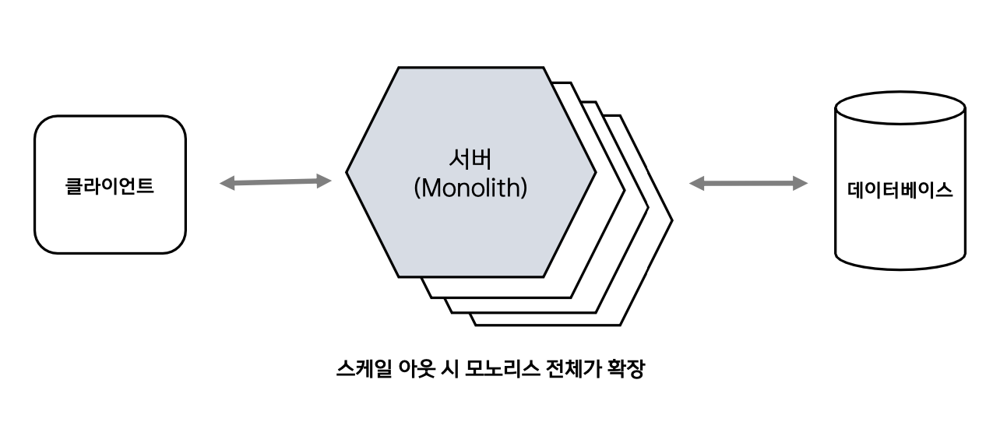
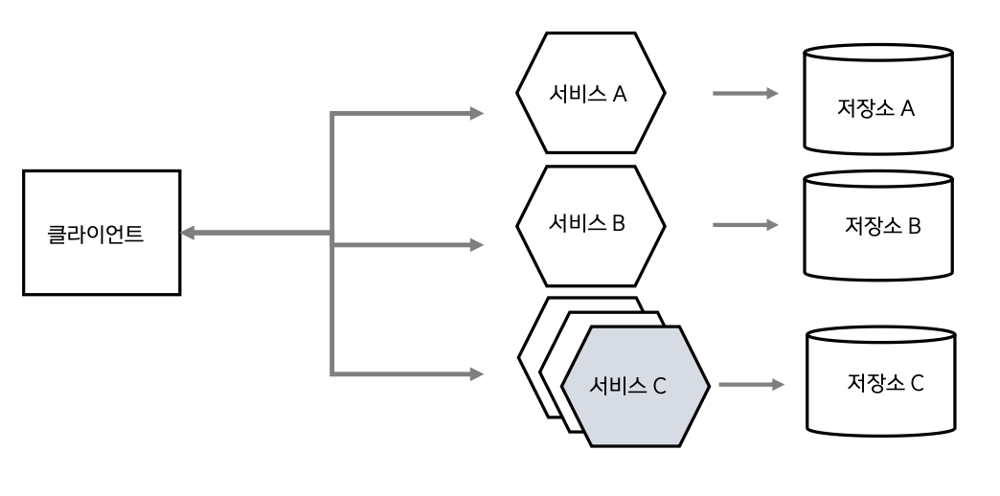

1.마이크로서비스 개념
=========================
## ⭕ 모노리스
모노리스는 소프트웨어 아키텍처 개념으로 하나의 통합된 애플리케이션 구조를 의미한다.
- 애플리케이션이 한 덩이로 구성
- 단일 프로세스 진행
- 한번에 수정/배포됨
- 하나가 실패하면 모두 실패됨

 
### ◉ 인프라 구성 시 단점
클라우드의 장점은 오토스케일링, 스케일아웃 등 사용량에 따라서 서버를 확장하는 탄력적인 확장성이 있는데 모놀리스는 전체 서비스가 확장되어야 하는 단점이 있다.
필요할 때 필요한 만큼 사용하는 온디멘드가 불가능하기 때문에 서비스 관리나 비용 차원에서 효율적이지 않다.

#### ✦ 쇼핑몰 예시
1. 확정성 문제 : 특정 시간대에 결제 요청만 많이 발생하는 경우 결제 서비스만 확장하면 되지만 모노리스에서는 전체 서비스가 확장되어야 함
2. 장애 문제 : 쇼핑몰에서 상품 조회 서비스가 장애가 발생하면 결제 서비스도 영향을 받아서 결제가 불가능해짐
3. 배포 문제 : 쇼핑몰에서 상품 조회 서비스에 버그가 발생했을 때 전체 서비스를 배포해야 함 결제 서비스도 영향을 받아서 결제 서비스도 배포해야 함
4. 개발 문제 : 쇼핑몰에서 리뷰 기능은 대량의 데이터를 처리하기 위해 파이썬으로 개발하고 싶지만 결제 서비스는 자바로 개발되어 있어서 리뷰 기능을 파이썬으로 개발할 수 없음

## ⭕ 마이크로서비스
마이크로서비스 아키텍처(MSA)는 애플리케이션을 작고 독립적인 서비스로 나누어 개발하는 방법이다.
- 서비스는 각기 독립적인 기능을 제공
- 서비스가 사용하는 저장소는 다른 서비스와 완벽히 격리되기 떄문에 독립적으로 수정 가능하고 별도 배포, 확장 가능
- 하나의 서비스 실패는 전체 실패가 아닌 부분적인 실패로 이어짐

### ◉ 마이크로서비스의 기능
- 여러 개의 작은 서비스 집함으로 개발
- 각 서비스는 개별 프로세스로 실행
- HTTP 자원 API 같은 경량 프로토콜을 통해 통신
- 서비스는 비지니스 기능 단위로 캡슐화
- 각 서비스는 다른 기술 스택, 데이터 베이스를 사용 가능

### ◉ SOA란?
SOA(Service-Oriented Architecture, 서비스 지향 아키텍처)는 대규모 엔터프라이즈 시스템을 구축할 때 비즈니스 기능을 서비스라는 독립적인 부품(컴포넌트)의 조합으로 구현하는 아키텍처 스타일이다. 이를 통해 시스템을 유연하고 재사용 가능하게 만드는 것을 목표로 한다.

### ◉ MSA와 SOA 차이점
SOA(서비스 지향 아키텍처)와 MSA(마이크로서비스 아키텍처)는 모두 서비스 기반 아키텍처이지만 몇 가지 중요한 차이점이 있다.

| 항목             | MSA (Microservices Architecture)         | SOA (Service-Oriented Architecture)         |
|------------------|-------------------------------------------|---------------------------------------------|
| 서비스 크기       | 작고 세밀한 기능 단위                    | 상대적으로 크고 범용적인 기능 단위          |
| 독립성           | 서비스는 완전 독립 (DB 포함)              | 서비스 간 DB 공유 가능                      |
| 배포             | 개별 서비스 단위로 배포 (CI/CD)           | 전체 플랫폼의 통합 배포가 많음              |
| 기술 스택 자유    | 서비스마다 언어/프레임워크 다르게 가능     | 플랫폼 표준에 따라 통일될 수 있음           |
| 모듈 재사용       | 서비스 간 코드 공유 없이 완전 분리         | 공통 모듈 재사용 강조, 서비스 간 의존성 생길 수 있음 |

#### ✦ SOA의 장점
1. 서비스 재사용성: 한번 개발된 서비스는 여러 애플리케이션에서 재사용 가능, 개발 시간과 비용 절감, 중복 개발 방지하여 생산성을 높임
2. 높은 유연성 및 민첩성: 비즈니스 환경이나 프로세스가 변경될 때 전체 시스템을 수정하는 대신 관련된 특정 서비스만 수정하거나 교체하면 되므로 변화에 신속하게 대응할 수 있음
3. 상호운용성: SOA는 웹 서비스와 같은 표준 기술을 사용하여 구현되어 서로 다른 플랫폼이나 프로그래밍 언어로 개발된 시스템이라도 쉽게 연동하고 통합할 수 있음
4. 느슨한 결합: 각 서비스는 독립적으로 작동하며 다른 서비스의 내부 구현 방식에 의존하지 않음, 이를 통해 시스템의 유지보수성과 확장성을 높임
5. 기존 시스템(Legacy) 통합 용이: 레거시 시스템을 서비스로 감싸서 새로운 애플리케이션과 쉽게 통합할 수 있음

#### ✦ SOA의 단점
1. 구현 및 관리의 복잡성 증가: 서비스의 개수가 늘어나면 서비스 간의 상호작용과 의존 관계가 복잡해져 전체 시스템을 파악하고 관리하기 어려워진다.
2. 데이터베이스 통합으로 인한 강한 결합: 여러 서비스가 동일한 데이터베이스의 테이블을 직접 공유하는 경우 DB 스키마 변경이 해당 테이블을 사용하는 모든 서비스에 영향을 미칠 수 있다. 이는 서비스 간의 강한 결합을 초래하고 독립적인 배포를 어렵게 만든다.
3. 공통 모듈로 인한 암묵적 의존성: 여러 서비스에서 공통 로직을 재사용하기 위해 공통 라이브러리나 모듈을 사용하는 경우 이 공통 모듈의 변경이 의존하는 모든 서비스를 동시에 수정하고 재배포해야 하는 상황을 만들 수 있다. 
4. 성능 오버헤드 발생: 서비스 간의 통신은 대부분 네트워크를 통해 이루어지므로 이 과정에서 발생하는 통신 지연 시간 때문에 단일 애플리케이션에 비해 성능 저하가 발생할 수 있다. 특히 중앙 미들웨어인 ESB는 병목 지점이 될 수 있다.
5. 단일 장애점 문제: 중앙 집중적인 ESB를 사용하는 아키텍처에서 ESB에 장애가 발생하면 이를 통해 통신하는 전체 서비스가 마비되는 단일 장애점이 될 수 있습니다.
6. 트랜잭션 및 테스트의 어려움: 하나의 비즈니스 로직이 여러 서비스에 걸쳐 분산되어 실행될 경우 데이터의 일관성을 유지하는 분산 트랜잭션 관리가 매우 복잡해질 수 있다. 또한 여러 서비스의 상호작용을 모두 검증해야 하므로 통합 테스트가 어렵고 시간이 많이 소요된다.

#### ❓ ESB(Enterprise Service Bus)란?
ESB는 기업 내의 다양한 애플리케이션과 서비스들을 하나의 버스에 연결하여 서로 원활하게 통신하고 통합할 수 있도록 지원하는 미들웨어 아키텍처이다.
서비스 지향 아키텍처(SOA)의 핵심 구성 요소로 각 서비스를 독립적으로 유지하면서도 서로 유기적으로 연결될 수 있게 만드는 기반 기술이다.

##### 주요 기능
- 메시지 라우팅: 서비스 요청 메시지가 들어왔을 때 그 내용을 분석하여 어떤 서비스로 전달해야 할지 결정하고 경로를 지정
- 메시지 변환: 서로 다른 시스템이 사용하는 데이터 형식(포맷)을 자동으로 변환해주는 기능
- 프로토콜 변환: 시스템마다 사용하는 통신 방식(프로토콜)이 달라도 ESB가 중간에서 이를 변환하여 통신이 가능하게 하는 기능
- 통합 및 중개: 레거시 시스템부터 최신 클라우드 애플리케이션까지 다양한 종류의 시스템을 표준화된 방식으로 연결하여 통합 구조를 단순화
- 보안 및 모니터링: 모든 서비스 요청과 응답이 ESB를 통과하므로 이곳에서 통합적으로 인증/인가를 처리하고 트랜잭션을 모니터링하며 로그를 기록하는 등 중앙 집중적인 관리하는 기능
---
