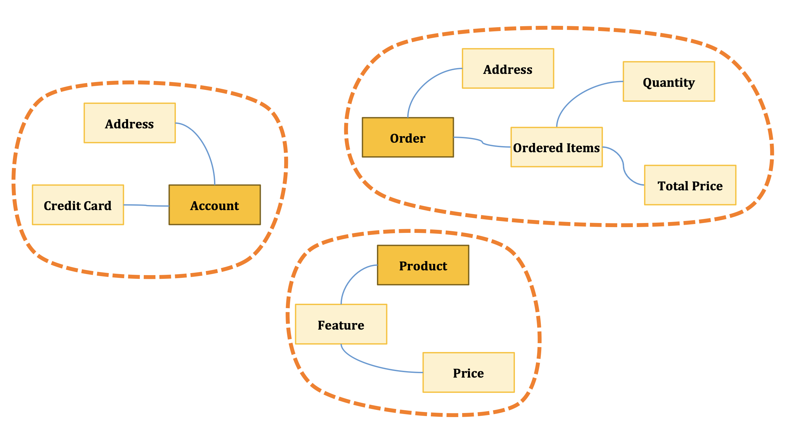

6.도메인 주도 설계(전술적 설계 이해)
=========================
## ⭕비즈니스 로직 구현 패턴
- 트랜잭션 스크립트 패턴
- 액티브 레코드 패턴
- 도메인 모델 패턴
- 애그리거트 패턴
- 이벤트 소싱 모델

## ⭕ 트랜잭션 스크립트 패턴
트랜잭션 스크립트 패턴은 간단한 비즈니스 로직을 구현할 때 사용되는 패턴으로 주로 단순한 CRUD 작업에 적합하다.
이 패턴은 비즈니스 로직을 단일 프로시저나 메소드로 구현하여 데이터베이스 트랜잭션을 관리한다.
- 간단한 비지니스 로직 구현의 경우
- 절차 지향 스크립트로 구현, 데이터 베이스 직접 접근도 가능
- 각 작업은 성공하거나 실패할 수 있지만 유효하지 않는 상태로 만들면 안된다 
- 단순한 지원 하위 도메인, 연동 어댑터, 충돌 방지 계층
- 비즈니스 로직이 복잡할수록 트랜잭션간 비즈니즈 로직이 중복되기 쉽고 결과적으로 중복된 코드가 동기화 되지 않으면 일관성 없는 동작이 발생됨
-> 유지보수가 불가능한 거대한 진흙 덩어리가 될 가능성 높음
- 핵심 하위 도메인에는 사용하지 않는 것이 좋다.


### ◉ 장점
- 이해하기 쉽고 구현이 간단 
- 작은 프로젝트에 적합 
- 디버깅이 용이

### ◉ 단점
- 복잡한 비즈니스 로직에는 부적합
- 코드 재사용이 어려움
- 유지보수가 힘들어질 수 있음

### ◉ 예제
```text
주문 처리 스크립트() {
  1. 사용자 정보 확인
  2. 상품 재고 확인  
  3. 재고 차감
  4. 주문 생성
  5. 결제 처리
  6. 배송 정보 등록
  
  // 중간에 실패하면 모든 작업 롤백
}
```

## ⭕액티브 레코드 패턴
액티브 레코드 패턴은 객체 지향 프로그래밍에서 데이터베이스의 테이블을 객체로 매핑하여 CRUD 작업을 수행하는 패턴이다.
- 비지니스 로직이 단순한 경우
- Active Record 라는 전용 객체를 사용하여 복잡한 자료 구조를 표현, 자료 구조 외에도 CRUD 구현,ORM 연계
- 즉 Active Record 는 데이터 접근 로직 구현
- Entity 에 약간의 비즈 로직 포함 가능하지만 대부분의 비지니스로직 및 흐름은 응용서비스의 행위에 의해 처리됨
- Anemic Domain Model (빈약한 도메인 모델)
- 본질적으로는 데이터베이스 접근을 최적화하는 Transaction Script 패턴의 유형
- 모델에 있는 로직은 사용자 입력의 유효성을 검사하는 CRUD작업과 같은 비교적 간단한 비즈로직
- 지원 하위 도메인, 일반 하위 도메인에 적합
- 비즈 로직은 단순하지만 복잡한 자료 구조인 경우


### ◉ 장점
- 구현이 직관적이고 이해하기 쉬움
- 빠른 개발과 프로토타입 제작에 적합
- 단순한 CRUD 작업에 효율적
- ORM 프레임워크 지원으로 개발 생산성 향상
- 데이터와 행위가 한 곳에 모여 있어 응집도가 높음

### ◉ 단점
- 복잡한 비즈니스 로직 구현에 부적합
- 데이터베이스 스키마 변경 시 영향 범위가 큼
- 테스트가 어려움 (데이터베이스 의존성)
- 빈약한 도메인 모델이 되기 쉬움
- 대규모 시스템에서 유지보수 어려움

### ◉ 예제
``` kotlin
class Order {
    var customerId: Long = 0
    var productId: Long = 0
    var amount: Double = 0.0
    
    fun save() {
        // 데이터베이스에 저장 로직
    }
}

class CreateOrder {
    fun execute(orderDetails: OrderDetails) {
        try {
            db.startTransaction()
            
            val order = Order()
            order.customerId = orderDetails.customerId
            order.productId = orderDetails.productId
            order.amount = orderDetails.amount
            order.save()
            
            db.commit()
        } catch (e: Exception) {
            db.rollback()
            throw e
        }
    }
}
```

## ⭕도메인 모델 패턴
도메인 모델 패턴은 비즈니스 도메인을 객체로 모델링하여 복잡한 비즈니스 로직을 표현하는 패턴이다.
- 도메인 모델은 행위 + 자료구조를 통해 비지니스 로직 구현
- POJO로 구성 : 이미 본질적으로 복잡하므로 인프라, 기술적 관심사를 피해야 함
- 응용서비스에서는 대부분 업무 흐름 제어만 하며 주요 비지니스 로직은 도메인 모델에 위임하여 처리


### ◉ 장점
- 복잡한 비즈니스 로직을 객체지향적으로 표현 가능 
- 도메인 지식이 코드에 명확히 표현되어 유지보수성 향상 
- 단위 테스트 작성이 용이함 (인프라 의존성 최소화)

### ◉ 단점
- 초기 설계 비용이 높음 (도메인 분석 및 모델링 필요)
- 단순한 CRUD 작업에는 과도한 복잡성 초래
- 개발자의 높은 객체지향 설계 역량 요구

## ⭕ 애그리거트 패턴
- 도메인 모델 패턴 적용 시 도메인 모델이 점점 복잡하고 비대해짐
- 이에 그 복잡성을 관리할 단위를 구분해 냄 (도메인 주도의 Aggregate)
- 대부분 한개의 Entity와 여러개의 VO구성


### ◉ 장점
- 도메인 모델의 복잡성을 논리적 단위로 분할하여 관리
- 트랜잭션 일관성 경계를 명확히 정의
- 애그리거트 루트를 통한 접근으로 무결성 보장

### ◉ 단점
- 애그리거트 경계 설정이 어려워 잘못 나누면 성능 저하
- 애그리거트 간 참조 제약으로 구현 복잡도 증가
- 초기 설계 시 높은 도메인 지식과 경험 필요

### ◉ 애그리거트 패턴 구성요소 - Value Object
Value Object(VO)는 식별자가 없고 값 자체로 동등성을 판단하는 불변 객체입니다.
- 식별자: 값 자체가 중요
- 불변성: 생성 후 변경 불가
- 값 동등성: 모든 속성 값이 같으면 동일한 객체
- DTO와 헷갈리지 말 것 DTO는 프레젠테이션 계층과 도메인 계층에서 사용되는 구조체 개념

#### ✦ 예제
```kotlin
data class Money(
    val amount: BigDecimal,
    val currency: String = "KRW"
)

data class Address(
    val zipCode: String,
    val city: String,
    val street: String
)

val price = Money(BigDecimal("10000"))
val address = Address("12345", "서울시", "강남대로")
```

### ◉ 애그리거트 패턴 구성요소 - Entity
Entity는 고유한 식별자를 가지며 생명주기 동안 상태가 변할 수 있는 가변 객체입니다.
- 모든 도메인의 필수 구성요소
- 도메인의 고유 개념 표현
- 상태 변경 가능 (가변성)
- 자신의 생명주기와 행위를 가짐
- 다른 객체와 구별할 수 있는 식별자(고유 식별자)를 갖는 객체
- DB Entity와의 차이: 데이터와 함께 기능(행위)을 제공

#### ✦ 예제
```kotlin
class Product(
    val id: Long,
    var name: String,
    var price: Money
) {
    fun changePrice(newPrice: Money) {
        this.price = newPrice
    }
}

// 사용 예제
val product = Product(1L, "노트북", Money(BigDecimal("1500000")))
product.changePrice(Money(BigDecimal("1400000"))) // 상태 변경 가능

// 동등성 비교 - ID로만 판단
val product1 = Product(1L, "노트북", Money(BigDecimal("1500000")))
val product2 = Product(1L, "맥북", Money(BigDecimal("2000000")))
```


### ◉ 애그리거트 패턴 구성요소 - 애그리거트
애그리거트는 도메인 모델의 복잡성을 관리하기 위해 관련된 Entity와 Value Object를 그룹화한 단위이다.
- 관련 객체를 하나로 묶은 군집
- Aggregate는 Entity, 목적은 데이터 일관성을 보호, 데이터 변경 시 Aggregate 단위로 처리
- Aggregate Root를 통해 Aggregate 내의 다른 Entity 및 VO 접근
- 데이터 변경의 단위, 트랜잭션 단위가 되는 연관된 객체 묶음



#### ✦ 설계 고려사항
- 하나의 Transaction에서는 하나의 Aggregate만 수정함
- Transaction 일관성과 성공을 보장하도록 Aggregate 구성요소들을 설계해야 함
- 하나의 일을 잘 수행할 수 있도록 작게 설계해야함
- 작게 설계할 수록 성능이 좋고 확장에 용이함, 변경사항 Commit할 때 문제도 거의 발생되지 않음
- 한 Aggregate 에서 다른 Aggregate 의 참조는 식별자를 통해서만 참조해야 함
- 하나의 Transaction 내에서 여러 개의 Aggregate 이 수정되는 것을 방지할 수 있음
- 하나의 Transaction에서 여러 개의 Aggregate이 갱신되어야 하는 경우 다른 Aggregate 의 갱신은 비동기 통신을 활용해서 결과적 일관성을 맞춰야 함

##### ❓결과적 일관성
일관성을 유지시켜야 하는 데이터가 일정시간 다른 데이터와 일치 하지 않을 수도 있지만 어느 시점이 되면 결국 일치하게 된다.


#### ✦ 특징
- 각 Aggregate은 일관성 있는 Transaction 경계를 형성함
- 즉, Transaction 제어가 DB에 Commit 될 때 한 Aggregate 내의 모든 구성요소들은 비즈니스 규칙을 따르면서 일관성 있게 처리되어야 함

#### ✦ 문제점
- 시간이 지날수록 하위의 객체의 인스턴스의 증가가 결국 엄청난 크기로 불어날 수 있음
- 따라서 하나의 일을 잘 수행할 수 있는 작은 Aggregate로 분리해야함

### ◉ 애그리거트 패턴 구성요소 - 도메인 이벤트
도메인 이벤트는 도메인 모델에서 발생한 중요한 사건을 나타내는 객체로 시스템의 상태 변화나 비즈니스 로직의 결과를 표현한다.
- 과거형으로 표시
- Aggregate의 퍼블릭 인터페이스의 일부, Aggregate는 자신의 Domain Event를 발행

##### 예제
- 주문: 주문됨, 취소됨
- 결제: 결제됨, 결제 실패됨
- 회원: 회원 가입됨, 회원 정보 수정됨

### ◉ 애그리거트 패턴 구성요소 - 도메인 서비스
특정 Entities/Value Objects에 속하지 않는 도메인 로직 또는 복수의 Aggregate 에 관련된 비지니스 로직 제공
- 어떤 계산이나 분석을 위해 다양한 시스템 구성요소의 호출을 조율

#### ✦ 특징
- 상태가 없는 객체
- 비즈니스 처리를 위해 다수의 Aggregate 이 포함되어야 하는 경우 Service 객체를 만들어서 처리함
- 여러 Aggregate의 데이터를 읽는 것이 필요한 계산 로직 구현을 도와줌

#### ✦ 예제
- 재고, 배송비 계산, 할인 정책 적용 등


### ◉ 애그리거트 패턴 구성요소 - 레포지토리
레포지토리는 Aggregate를 영속화하고 조회하는 역할을 하는 객체로 도메인 모델과 데이터베이스 간의 매핑을 담당한다.
- 도메인 모델을 사용하기 위해서 Repository를 통해 도메인 객체를 조회 한 후 도메인 객체의 기능을 실행
- 도메인 객체(Aggregate)에 대한 생명주기, 즉 영속성 관리 (등록, 조회, 수정, 삭제 시 Aggregate의 일관성 유지)
- Spring Data JPA의 Repository인터페이스

### ◉ 애그리거트 패턴 구성요소 - 팩토리
복잡한 Entity나 Aggregate를 생성하는 로직을 캡슐화하여 객체 생성의 복잡성을 줄이는 역할을 한다.

#### ✦ 특징
- 객체의 생성 과정과 관련된 지식이 정리된 객체로 특정 정보를 Factory에 보내면 결과로 Entity 또는 Aggregate 을 생성함
- 복잡한 생성 로직을 숨겨 개발자들이 내부의 복잡함에 신경 쓰지 않아도 됨

### ◉ 애그리거트 패턴 구성요소 - 응용 서비스
Repository에서 데이터를 조회하고 도메인 로직을 호출한 후 결과를 저장하는 과정을 하나의 트랜잭션으로 묶어서 처리하는 서비스다.
- 도메인 모델에 속하지 않음.
- Repository 와 밀접한 연관
- 트랜잭션 처리
- 응용계층
- Aggregate 를 저장하는 메소드, Aggregate Root 식별자로 Aggregate를 조회하는 Method 제공

#### ✦ 예제
- 주문 서비스
- 결제 서비스
- 회원 서비스

## ⭕이벤트 소싱 모델
이벤트 소싱 모델은 도메인 이벤트를 중심으로 시스템의 상태를 관리하는 패턴이다. 모든 상태 변화는 이벤트로 기록되며 현재 상태는 이벤트의 시퀀스를 통해 재구성된다.
- 상태 변화 이벤트만 저장 (기존 방식은 상태 기반, 상태를 DB에 저장)
- 현재 상태는 이벤트들을 순서대로 재생해서 복원

### ◉ 특징
- 불변성: 이벤트는 변경되지 않으며 모든 상태 변화는 이벤트로 기록됨
- 재현 가능성: 이벤트를 재생하여 시스템의 상태를 언제든지 재구성할 수 있음
- 추적: 이벤트 로그를 통해 시스템의 모든 상태 변화 이력을 추적할 수 있음

### ◉ 예제
- 주문 생성 이벤트, 결제 완료 이벤트, 배송 시작 이벤트 등

##### ❓어느 시점에 어떤 패턴을 사용 해야 하는가?
 🟢 간단한 CRUD 중심 (복잡도: 낮음) - 추천 패턴: 트랜잭션 스크립트 패턴
- 언제: 게시판, 사용자 관리, 설정 관리
- 특징: 빠른 개발, 직관적 구조
- 예시: 블로그, 간단한 관리자 페이지

🟡 중간 복잡도 비즈니스 로직 - 추천 패턴: 액티브 레코드 패턴
- 언제: ORM 활용, 적당한 비즈니스 규칙
- 특징: Rails, Django 스타일
- 예시: 소규모 쇼핑몰, 예약 시스템

🟠 복잡한 비즈니스 도메인 (복잡도: 높음) - 추천 패턴: 도메인 모델 패턴
- 언제: 복잡한 규칙, 여러 객체 간 상호작용
- 특징: 객체지향 설계 원칙 적용
- 예시: 은행 시스템, 대형 이커머스

🔴 매우 복잡한 엔터프라이즈 (복잡도: 매우 높음) - 추천 패턴: 애그리거트 패턴
- 언제: 여러 팀, 큰 규모, 복잡한 도메인
- 특징: DDD 전면 적용, 바운디드 컨텍스트
- 예시: 대기업 ERP, 금융 플랫폼

⚫ 특수 요구사항 (감사추적/분석 중요) - 추천 패턴: 이벤트 소싱
- 언제: 완벽한 이력 관리, 복잡한 분석
- 특징: 모든 변화 기록, 시간 여행 가능
- 예시: 금융 거래, 의료 기록

##### ❓우리가 개발하는 서비스는 어떤 패턴인가?
**현재 구조의 특징**
- 도메인별 명확한 분리
- 서비스간 협력적 관계
- 서비스 단위의 트랜잭션 경계
- DTO 활용
- 비즈니스 로직이 서비스에 집중
- 엔티니는 데이터 컨테이너 역할만 수행

→ 결론: 하이브리드 트랜잭션 스크립트 + 도메인별 분리 패턴

##### ❗️도메인 모델 패턴으로 개선할 경우
**현재 구조의 문제점**
- Entity가 빈약한 도메인 모델로 단순 데이터 저장소 역할만 함
- 비즈니스 로직이 서비스에 분산되어 절차적으로 구현됨
- 도메인 규칙과 제약사항이 코드로 명시적 표현되지 않음
- DTO 중심 설계로 도메인 개념이 희석됨
- 복잡한 비즈니스 로직의 재사용성과 테스트 용이성 부족

**개선점**
- Entity에 해당 도메인의 핵심 비즈니스 로직 이동 (검증, 상태 변경, 계산)
```kotlin
// AS-IS
@Entity
class Order {
    var id: Long? = null
    var customerId: Long = 0
    var totalAmount: BigDecimal = BigDecimal.ZERO
    var status: String = "PENDING"
    var orderDate: LocalDateTime = LocalDateTime.now()

    // getter/setter만 존재
}

@Service
class OrderService {
    fun cancelOrder(orderId: Long) {
        val order = orderRepository.findById(orderId)

        // 서비스에 모든 비즈니스 로직
        if (order.status == "SHIPPED") {
            throw IllegalStateException("배송된 주문은 취소할 수 없습니다")
        }
        if (ChronoUnit.HOURS.between(order.orderDate, LocalDateTime.now()) > 24) {
            throw IllegalStateException("24시간이 지난 주문은 취소할 수 없습니다")
        }

        order.status = "CANCELLED"
        orderRepository.save(order)
    }
}

// TO-BE
@Entity
class Order {
    var id: Long? = null
    var customerId: Long = 0
    private var totalAmount: BigDecimal = BigDecimal.ZERO
    private var status: OrderStatus = OrderStatus.PENDING
    private var orderDate: LocalDateTime = LocalDateTime.now()

    // 비즈니스 로직을 Entity로 이동
    fun cancel() {
        validateCancelable()
        this.status = OrderStatus.CANCELLED
    }

    fun ship() {
        if (status != OrderStatus.CONFIRMED) {
            throw IllegalStateException("확정된 주문만 배송할 수 있습니다")
        }
        this.status = OrderStatus.SHIPPED
    }

    fun isCancelable(): Boolean {
        return status == OrderStatus.PENDING || status == OrderStatus.CONFIRMED
    }

    fun isWithinCancelWindow(): Boolean {
        return ChronoUnit.HOURS.between(orderDate, LocalDateTime.now()) <= 24
    }

    private fun validateCancelable() {
        if (!isCancelable()) {
            throw IllegalStateException("${status.name} 상태의 주문은 취소할 수 없습니다")
        }
        if (!isWithinCancelWindow()) {
            throw IllegalStateException("24시간이 지난 주문은 취소할 수 없습니다")
        }
    }
}

@Service
class OrderService {
    fun cancelOrder(orderId: Long) {
        val order = orderRepository.findById(orderId)
        order.cancel() // 비즈니스 로직은 Entity에 위임
    }
}
```
- DTO를 Value Object로 전환하여 불변성과 도메인 의미 강화
```kotlin
// AS-IS
data class OrderDTO(
    var customerId: Long,
    var items: MutableList<OrderItemDTO>,
    var shippingAddress: String,
    var paymentMethod: String
) {
    // 단순 데이터 전달만
}

data class OrderItemDTO(
    var productId: Long,
    var quantity: Int,
    var price: BigDecimal
)

// TO-BE
data class ShippingAddress(
    val street: String,
    val city: String,
    val zipCode: String,
    val country: String
) {
    init {
        require(zipCode.matches(Regex("\\d{5}"))) { "우편번호는 5자리 숫자여야 합니다" }
        require(street.isNotBlank()) { "주소는 필수입니다" }
    }

    fun isInternational(): Boolean = country != "KR"

    fun getFullAddress(): String = "$street, $city $zipCode, $country"
}

data class Money(
    val amount: BigDecimal,
    val currency: String = "KRW"
) {
    init {
        require(amount >= BigDecimal.ZERO) { "금액은 0 이상이어야 합니다" }
    }

    fun add(other: Money): Money {
        require(currency == other.currency) { "통화가 다릅니다" }
        return Money(amount + other.amount, currency)
    }

    fun multiply(multiplier: Int): Money {
        return Money(amount * BigDecimal(multiplier), currency)
    }

    fun isGreaterThan(other: Money): Boolean {
        require(currency == other.currency) { "통화가 다릅니다" }
        return amount > other.amount
    }
}

data class OrderItem(
    val productId: Long,
    val quantity: Int,
    val unitPrice: Money
) {
    init {
        require(quantity > 0) { "수량은 1개 이상이어야 합니다" }
    }

    fun getSubtotal(): Money = unitPrice.multiply(quantity)

    fun isBulkOrder(): Boolean = quantity >= 10
}
```
- 복잡한 계산 로직은 도메인 서비스로 분리
```kotlin
// AS-IS
@Service
class OrderService {
    fun calculateOrderTotal(orderItems: List<OrderItemDTO>): BigDecimal {
        var total = BigDecimal.ZERO

        // 복잡한 할인 계산 로직
        orderItems.forEach { item ->
            val subtotal = item.price.multiply(BigDecimal(item.quantity))

            // 대량 주문 할인
            val discount = if (item.quantity >= 10) {
                subtotal.multiply(BigDecimal("0.1"))
            } else BigDecimal.ZERO

            total = total.add(subtotal.subtract(discount))
        }

        // VIP 할인
        if (isVipCustomer()) {
            total = total.multiply(BigDecimal("0.95"))
        }

        return total
    }
}

// TO-BE
@Component
class PricingService {
    fun calculateOrderTotal(orderItems: List<OrderItem>, customer: Customer): Money {
        val subtotal = calculateSubtotal(orderItems)
        val discountAmount = calculateDiscount(orderItems, customer)
        return subtotal.subtract(discountAmount)
    }

    private fun calculateSubtotal(orderItems: List<OrderItem>): Money {
        return orderItems.fold(Money(BigDecimal.ZERO)) { acc, item ->
            acc.add(item.getSubtotal())
        }
    }

    private fun calculateDiscount(orderItems: List<OrderItem>, customer: Customer): Money {
        val bulkDiscount = calculateBulkDiscount(orderItems)
        val vipDiscount = calculateVipDiscount(orderItems, customer)
        val seasonalDiscount = calculateSeasonalDiscount(orderItems)

        return bulkDiscount.add(vipDiscount).add(seasonalDiscount)
    }

    private fun calculateBulkDiscount(orderItems: List<OrderItem>): Money {
        return orderItems
            .filter { it.isBulkOrder() }
            .fold(Money(BigDecimal.ZERO)) { acc, item ->
                acc.add(item.getSubtotal().multiply(0.1))
            }
    }

    private fun calculateVipDiscount(orderItems: List<OrderItem>, customer: Customer): Money {
        if (!customer.isVip()) return Money(BigDecimal.ZERO)

        val subtotal = calculateSubtotal(orderItems)
        return subtotal.multiply(0.05)
    }

    private fun calculateSeasonalDiscount(orderItems: List<OrderItem>): Money {
        // 복잡한 계절별 할인 로직
        return Money(BigDecimal.ZERO)
    }
}

@Component
class ShippingService {
    fun calculateShippingFee(items: List<OrderItem>, address: ShippingAddress): Money {
        val totalWeight = calculateTotalWeight(items)
        val baseFee = getBaseFee(address)
        val weightFee = calculateWeightFee(totalWeight)

        return baseFee.add(weightFee)
    }

    private fun calculateTotalWeight(items: List<OrderItem>): Double {
        // 복잡한 무게 계산 로직
        return items.sumOf { it.quantity * getProductWeight(it.productId) }
    }

    private fun getBaseFee(address: ShippingAddress): Money {
        return if (address.isInternational()) {
            Money(BigDecimal("15000"))
        } else {
            Money(BigDecimal("3000"))
        }
    }
}
```
- 서비스는 도메인 객체들의 협력을 조율하는 역할로 제한
```kotlin
// AS-IS
@Service
@Transactional
class OrderService(
    private val pricingService: PricingService,
    private val shippingService: ShippingService,
    private val inventoryService: InventoryService,
    private val customerService: CustomerService
) {
    fun createOrder(customerId: Long, orderItems: List<OrderItem>, shippingAddress: ShippingAddress): Long {
        // 1. 도메인 객체들 조회
        val customer = customerService.findById(customerId)

        // 2. 도메인 서비스들을 통한 계산
        val totalAmount = pricingService.calculateOrderTotal(orderItems, customer)
        val shippingFee = shippingService.calculateShippingFee(orderItems, shippingAddress)

        // 3. 재고 확인 (다른 도메인 서비스)
        inventoryService.reserveItems(orderItems)

        // 4. 주문 생성 (팩토리 메서드 사용)
        val order = Order.create(
            customerId = customerId,
            items = orderItems,
            totalAmount = totalAmount.add(shippingFee),
            shippingAddress = shippingAddress
        )

        return orderRepository.save(order).id!!
    }

    fun cancelOrder(orderId: Long) {
        val order = orderRepository.findById(orderId)

        // 도메인 객체에 위임
        order.cancel()

        // 재고 복원 (다른 도메인 협력)
        inventoryService.releaseReservation(order.getOrderItems())
    }
}

// TO-BE
@Service
@Transactional
class OrderService(
    private val pricingService: PricingService,
    private val shippingService: ShippingService,
    private val inventoryService: InventoryService,
    private val customerService: CustomerService
) {
    fun createOrder(customerId: Long, orderItems: List<OrderItem>, shippingAddress: ShippingAddress): Long {
        // 1. 도메인 객체들 조회
        val customer = customerService.findById(customerId)

        // 2. 도메인 서비스들을 통한 계산
        val totalAmount = pricingService.calculateOrderTotal(orderItems, customer)
        val shippingFee = shippingService.calculateShippingFee(orderItems, shippingAddress)

        // 3. 재고 확인 (다른 도메인 서비스)
        inventoryService.reserveItems(orderItems)

        // 4. 주문 생성 (팩토리 메서드 사용)
        val order = Order.create(
            customerId = customerId,
            items = orderItems,
            totalAmount = totalAmount.add(shippingFee),
            shippingAddress = shippingAddress
        )

        return orderRepository.save(order).id!!
    }

    fun cancelOrder(orderId: Long) {
        val order = orderRepository.findById(orderId)

        // 도메인 객체에 위임
        order.cancel()

        // 재고 복원 (다른 도메인 협력)
        inventoryService.releaseReservation(order.getOrderItems())
    }
}
```

- 도메인 전문가가 이해할 수 있는 코드 작성
```kotlin
// AS-IS
fun processPayment(orderId: Long, paymentData: Map<String, Any>) {
    val order = orderRepository.findById(orderId)

    // 문제 1: 매직 스트링 사용 - "PENDING"이 뭘 의미하는지 불분명
    // 문제 2: 복합 조건을 한 번에 검사 - 비즈니스 의도가 명확하지 않음
    if (order.status == "PENDING" && order.totalAmount > BigDecimal.ZERO) {

        // 문제 3: Map 타입으로 데이터 전달 - 타입 안전성 부족
        val result = paymentGateway.charge(paymentData)

        // 문제 4: 매직 스트링으로 결과 확인 - 오타 가능성, IDE 지원 부족
        if (result["status"] == "success") {
            // 문제 5: 직접 상태 변경 - 비즈니스 로직이 서비스에 노출
            order.status = "PAID"
        }
        // 문제 6: 실패 처리 누락 - 결제 실패 시 어떻게 할 것인지 명시되지 않음
    }
    // 문제 7: 반환값 없음 - 호출자가 결과를 알 수 없음
}

// TO-BE
fun processPayment(orderId: Long, paymentMethod: PaymentMethod): PaymentResult {
    val order = orderRepository.findById(orderId)

    // 개선 1: 비즈니스 의미가 명확한 메서드명 사용
    // "결제 준비가 되었는가?"라는 비즈니스 질문을 코드로 표현
    if (!order.isReadyForPayment()) {
        // 개선 2: 명확한 실패 이유 반환
        return PaymentResult.failure("주문이 결제 가능한 상태가 아닙니다")
    }

    // 개선 3: 의미있는 변수명과 메서드명
    val paymentAmount = order.getTotalAmount()

    // 개선 4: 타입 안전한 객체 사용 (PaymentMethod)
    val paymentResult = paymentProcessor.processPayment(paymentAmount, paymentMethod)

    // 개선 5: sealed class를 통한 타입 안전한 결과 처리
    when (paymentResult) {
        is PaymentResult.Success -> {
            // 개선 6: 도메인 객체에 비즈니스 로직 위임
            order.markAsPaid(paymentResult.transactionId)
            return PaymentResult.success(paymentResult.transactionId)
        }
        is PaymentResult.Failure -> {
            // 개선 7: 실패 상황도 도메인 로직으로 처리
            order.recordPaymentFailure(paymentResult.reason)
            return paymentResult
        }
    }
}

// 개선 8: 엔티티에 비즈니스 로직 이동
@Entity
class Order {
    // 개선 9: 비즈니스 규칙을 명확히 표현하는 메서드
    // 도메인 전문가가 "언제 결제가 가능한가?"라고 물어보면
    // 이 코드를 보여주며 설명할 수 있음
    fun isReadyForPayment(): Boolean {
        return status == OrderStatus.CONFIRMED && // 주문이 확정되어야 하고
                totalAmount.isGreaterThan(Money.ZERO) // 결제할 금액이 있어야 함
    }

    // 개선 10: 단순 상태 변경이 아닌 비즈니스 행위로 표현
    // "결제 완료 처리"라는 의미있는 행위
    fun markAsPaid(transactionId: String) {
        this.status = OrderStatus.PAID
        this.paymentTransactionId = transactionId // 추적 가능한 정보 저장
        this.paidAt = LocalDateTime.now() // 결제 시점 기록
    }

    // 개선 11: 실패 상황도 비즈니스 로직으로 관리
    fun recordPaymentFailure(reason: String) {
        this.paymentFailureReason = reason
        this.paymentAttempts += 1 // 재시도 횟수 추적

        // 비즈니스 규칙: 3번 실패하면 주문 취소
        if (paymentAttempts >= 3) {
            this.status = OrderStatus.PAYMENT_FAILED
        }
    }
}

// 개선 12: 타입 안전한 결과 객체
sealed class PaymentResult {
    data class Success(val transactionId: String) : PaymentResult()
    data class Failure(val reason: String) : PaymentResult()

    companion object {
        fun success(transactionId: String) = Success(transactionId)
        fun failure(reason: String) = Failure(reason)
    }
}

// 개선 13: 타입 안전한 결제 수단
sealed class PaymentMethod {
    data class CreditCard(val cardNumber: String, val expiryDate: String) : PaymentMethod()
    data class BankTransfer(val accountNumber: String) : PaymentMethod()
    object KakaoPay : PaymentMethod()
}
```

##### ❗️VO, DTO, Entity 구분
- Value Object (VO): 불변 객체로 식별자가 없고 값 자체로 동등성을 판단. 도메인 규칙과 제약을 포함.
- Data Transfer Object (DTO): 계층 간 데이터 전송을 위한 객체로 불변성을 보장하지 않으며 단순 데이터 구조. 주로 프레젠테이션 계층에서 사용.
- Entity: 고유 식별자를 가지며 상태가 변할 수 있는 가변 객체. 도메인 모델의 핵심 개념을 표현하고 비즈니스 로직을 포함.

```kotlin
// 🛒 쇼핑몰 예시

// VO - 도메인 개념, 불변, 값으로 동등성 판단
data class Money(
   val amount: BigDecimal,
   val currency: String = "KRW"
) {
   fun add(other: Money): Money {
       require(currency == other.currency)
       return Money(amount + other.amount, currency)
   }
}

data class Address(
   val street: String,
   val city: String,
   val zipCode: String
) {
   init {
       require(zipCode.matches(Regex("\\d{5}")))
   }
   
   fun isSeoul(): Boolean = city == "서울"
}

// Entity - 식별자 있음, 가변, 비즈니스 로직
@Entity
class Product {
   @Id
   var id: Long? = null
   private var name: String = ""
   private var price: Money = Money(BigDecimal.ZERO)
   
   fun changePrice(newPrice: Money) {
       require(newPrice.amount > BigDecimal.ZERO)
       this.price = newPrice
   }
}

@Entity  
class Order {
   @Id
   var id: Long? = null
   private var customerId: Long = 0
   private var shippingAddress: Address? = null // VO 사용
   private var totalAmount: Money = Money(BigDecimal.ZERO) // VO 사용
   
   fun ship(address: Address) {
       this.shippingAddress = address
   }
}

// DTO - API 통신용, 가변
data class ProductCreateRequestDTO(
   var name: String,
   var price: BigDecimal,
   var categoryId: Long
)

data class OrderResponseDTO(
   val orderId: Long,
   val customerName: String,
   val totalAmount: BigDecimal,
   val shippingAddress: String
)

// 사용 시점
@RestController
class ProductController {
   @PostMapping("/products")
   fun createProduct(@RequestBody dto: ProductCreateRequestDTO): ProductResponseDTO {
       // 1. DTO로 데이터 받음
       
       // 2. DTO → VO 변환
       val priceVO = Money(dto.price)
       
       // 3. Entity 생성
       val product = Product.create(dto.name, priceVO)
       
       // 4. Entity → DTO 변환해서 응답
       return ProductResponseDTO(product.id, product.name, product.price.amount)
   }
}
```

##### ❓VO를 사용해야 하는 이유
**단점**
- 파일 수 증가: 도메인 개념마다 별도 클래스 파일 생성 필요, 구조가 복잡해질 수 있음 
- 초기 개발 비용: VO 클래스 설계 및 구현에 추가 시간 소요, 단순 기능도 클래스로 감싸야 함 
- 메모리 오버헤드: 원시 타입 대신 객체 사용으로 메모리 사용량 증가, 객체 생성 비용 발생 
- 학습 비용: 개발팀의 VO 개념 학습 필요, 적절한 사용 시점 판단 경험 필요

**장점**
- 타입 안전성: 컴파일 시점에 잘못된 값 할당 방지, IDE 자동완성 및 오류 검출 지원 
- 비즈니스 로직 응집: 관련 로직이 VO 내부에 집중, 중복 코드 제거 및 일관된 처리 가능 
- 도메인 표현력: 코드가 비즈니스 언어를 직접 표현, 가독성과 이해도 향상 
- 재사용성: 여러 Entity에서 동일한 VO 활용 가능, 도메인 개념의 표준화 
- 불변성 보장: 예상치 못한 상태 변경 방지, 멀티스레드 환경에서 안전 
- 테스트 용이성: 개별 VO만 독립적으로 테스트 가능, 단위 테스트 작성 간소화

**결론**
초기 비용은 증가하지만 장기적으로 유지보수성, 안전성, 확장성에서 더 큰 이익 제공

##### ❗️애그리거트 패턴으로 전환하는 방법
- 애그리거트 경계 설정 
  - 관련된 엔티티들을 하나의 일관성 있는 단위로 그룹핑
  - 애그리거트 루트를 통해서만 내부 객체 접근 허용 
- Value Object 도입 
  - 정보들을 불변 Value Object로 모델링 
  - 변경이 필요한 경우 새로운 객체 생성하여 교체 
  - 비즈니스 로직을 Value Object에 포함시켜 응집도 향상 
- Repository 재구성 
  - 애그리거트 루트 단위로만 Repository 제공 
  - 개별 엔티티별 Repository 제거 
  - 복잡한 조회는 애그리거트 루트의 메서드로 캡슐화 
- 도메인 이벤트 활용 
  - 애그리거트 내부 상태 변경 시 도메인 이벤트 발행 
  - 횡단 관심사를 이벤트 리스너로 분리 (알림, 통계, 예측 모델 업데이트)
  - 다른 바운디드 컨텍스트와의 느슨한 결합 달성 
- 트랜잭션 경계 조정 
  - 트랜잭션 경계를 애그리거트 단위로 제한 
  - 하나의 트랜잭션에서는 하나의 애그리거트만 수정 
  - 여러 애그리거트 간 협력은 도메인 이벤트를 통해 최종 일관성 보장
